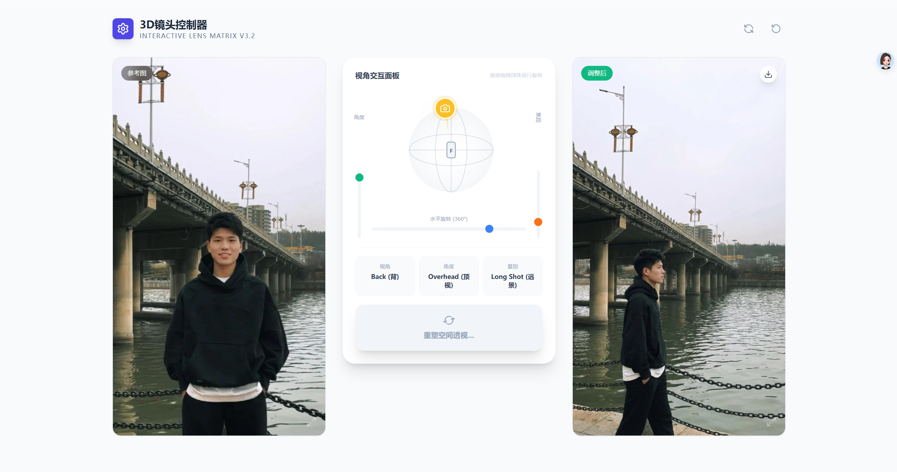
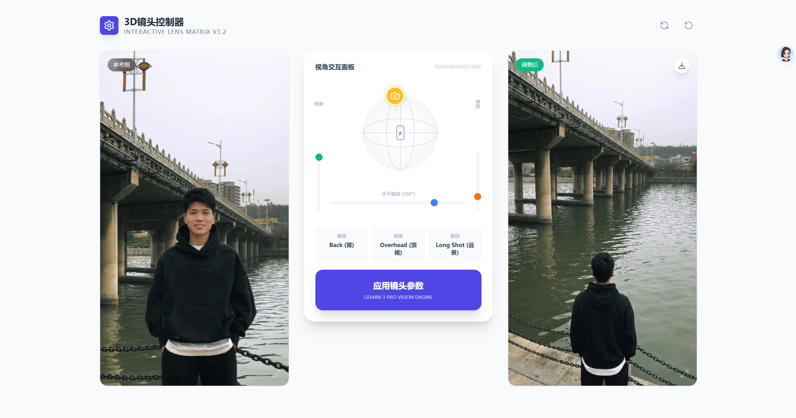

<div align="center">

# 3D 镜头控制器

Interactive Lens Matrix - 通过 3D 相机参数控制图片重新生成

[](https://nodejs.org)
[](https://react.dev)
[](https://vitejs.dev)

</div>

## 功能介绍

3D 镜头控制器是一个基于 AI 的图像视角调整工具。通过直观的 3D 球体控制器，你可以精确调整相机视角参数，然后使用 Gemini 图像生成模型重新生成图片。

### 核心功能

- **3D 视角控制** - 通过交互式球体和滑块控制相机位置
- **视角调整** - 水平 360° 旋转
- **角度调整** - 垂直 -90° 到 90° 俯仰
- **焦距调整** - 从特写到远景的镜头焦距控制
- **图生图** - 保持主体、颜色、光照不变，仅改变镜头透视

## 界面预览





## 本地运行

### 前置要求

- Node.js 18+

### 安装步骤

1. 安装依赖
   ```bash
   npm install
   ```

2. 启动开发服务器
   ```bash
   npm run dev
   ```

3. 在浏览器中打开应用，点击左上角设置图标配置 API

### API 配置

应用启动后，需要配置 Gemini API：

| 配置项 | 说明 | 默认值 |
|--------|------|--------|
| API 地址 | Gemini API 服务器地址 | `https://generativelanguage.googleapis.com` |
| API Key | 你的 Gemini API Key | - |
| 模型 | 使用的图像生成模型 | `gemini-2.5-flash-image` |

获取 API Key: https://ai.google.dev/

## 使用说明

1. **上传参考图** - 点击左侧区域上传图片
2. **调整视角** - 拖拽球体或使用滑块调整相机参数
   - 水平滑块：控制 360° 视角旋转
   - 左侧垂直滑块：控制俯仰角度（-90° 仰视到 90° 俯视）
   - 右侧垂直滑块：控制镜头焦距（特写到远景）
3. **生成图片** - 点击"应用镜头参数"按钮生成新视角的图片

## 技术栈

- **框架** - React 18 + TypeScript
- **构建工具** - Vite 5
- **样式** - Tailwind CSS 4
- **图标** - Lucide React
- **AI 模型** - Gemini 2.5 Flash Image

## 项目结构

```
CameraShot/
├── components/          # React 组件
│   └── CameraSphere.tsx # 3D 球体控制器
├── docs/                # 文档和截图
├── App.tsx              # 主应用组件
├── types.ts             # TypeScript 类型定义
├── constants.tsx        # 常量配置
└── vite.config.ts       # Vite 配置
```

## API 接口

生图接口文档详见：[docs/api.md](./docs/api.md)

### 接口格式

```
POST {baseUrl}/v1beta/models/{model}:generateContent?key={apiKey}
```

### 请求示例

```json
{
  "contents": [{
    "role": "user",
    "parts": [
      { "text": "提示词" },
      { "inline_data": { "mime_type": "image/png", "data": "base64..." } }
    ]
  }],
  "generationConfig": {
    "responseModalities": ["TEXT", "IMAGE"],
    "imageConfig": {
      "aspectRatio": "9:16",
      "imageSize": "1K"
    }
  }
}
```

## License

MIT
